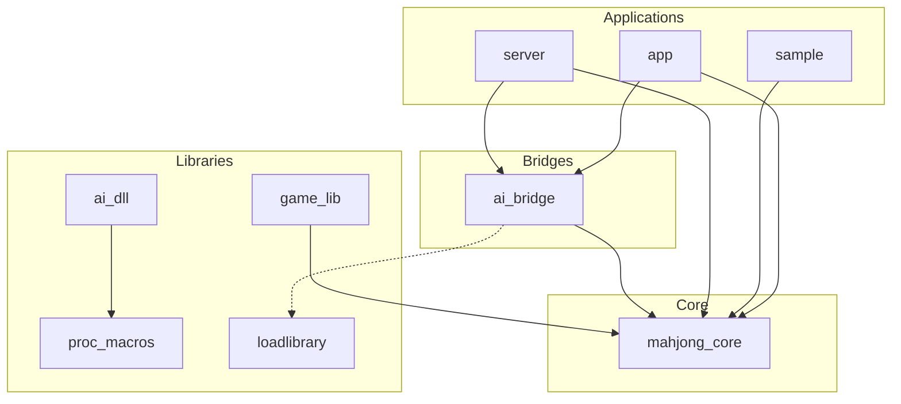

# 依存関係グラフ

プロジェクト内のクレート間の依存関係を以下に示します。

## クレート概要

- **mahjong_core**: 麻雀のコアロジック（牌、役判定、点数計算など）を提供します。
- **game_lib**: `mahjong_core` を使用したゲーム進行ライブラリ（詳細要確認）。
- **ai_bridge**: AI（DLL）と通信するためのブリッジライブラリ。
- **loadlibrary**: DLL読み込みのためのユーティリティ。
- **server**: 麻雀AIサーバーのメインプログラム。
- **app**: GUIアプリケーション（Iced使用）。
- **sample**: サンプルアプリケーション。
